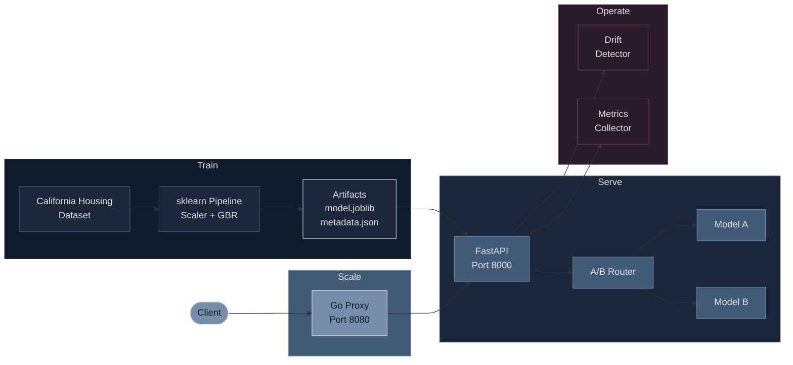

<div align="center">

# MLOps Engineering

**Production-grade ML systems built with Python and Go, deployed with containers and Kubernetes.**

[](https://python.org)
[](https://go.dev)
[](https://docker.com)
[](https://kubernetes.io)
[](https://github.com/mahesh-sadupalli/mlops-engineering/actions)
[](LICENSE)

</div>

<br>

## The Idea

Most ML projects stop at a Jupyter notebook. This one doesn't.

This repository takes a house price prediction model from raw data all the way to a production system — with a Go proxy for high-throughput inference, A/B testing for model variants, drift detection for incoming data, Kubernetes manifests for orchestration, and a CI/CD pipeline that gates every push.

The goal is simple: **show what it actually takes to ship an ML model**, not just train one.

---

## How It All Fits Together



Four stages, each with a clear job:

- **Train** — Load data, build a pipeline, evaluate, save artifacts, log everything to MLflow.
- **Serve** — FastAPI loads models, routes predictions through the A/B router, validates with Pydantic.
- **Operate** — A drift detector compares live feature distributions against training baselines. A metrics collector tracks prediction volume and latency per variant.
- **Scale** — A Go proxy adds connection pooling, request validation, size limits, and structured logging.

---

## The Model

Predicts **median house value** for California census block groups (in $100k units) using the 1990 U.S. Census dataset from scikit-learn.

**8 input features:** `MedInc`, `HouseAge`, `AveRooms`, `AveBedrms`, `Population`, `AveOccup`, `Latitude`, `Longitude`

**Gradient Boosting Regressor** (200 trees, depth 5, learning rate 0.1) wrapped in an sklearn Pipeline with StandardScaler preprocessing. Trained on 16,512 samples.

| | RMSE | MAE | R² |
|---|---|---|---|
| **Train** | 0.382 | 0.265 | 0.891 |
| **Test** | 0.466 | 0.311 | 0.835 |

---

## Training Pipeline

Fully reproducible. A `TrainingConfig` dataclass pins every parameter. Every run is logged to MLflow.

1. **Load & split** — California Housing dataset, 80/20 split, computes per-feature statistics for drift monitoring.
2. **Train & track** — sklearn Pipeline (StandardScaler + GBR), logs parameters and metrics to MLflow.
3. **Save & log** — Serializes to `model.joblib`, writes `metadata.json` with feature stats, uploads both as MLflow artifacts.

---

## Serving Layer

### FastAPI

The model API loads artifacts at startup. Supports single-model and multi-model (A/B) modes.

| Endpoint | Method | Purpose |
|----------|--------|---------|
| `/health` | GET | Liveness check with model load status |
| `/model/info` | GET | Model type, feature names, metrics |
| `/predict` | POST | Single prediction (returns variant name) |
| `/predict/batch` | POST | Batch prediction |
| `/ab/experiment` | GET | A/B experiment status and per-variant metrics |
| `/ab/weights` | PUT | Update traffic split live |
| `/monitoring/drift` | GET | Feature drift report against training baselines |

### Go Proxy

Python handles ML. Go handles traffic. The proxy sits in front of FastAPI:

- Validates requests before they reach Python (JSON structure, feature count)
- Limits request sizes (1MB single, 10MB batch)
- Pools TCP connections (100 max idle, 90s timeout)
- Logs every request as structured JSON via `slog`
- Tracks total requests, errors, and average latency at `/metrics`

---

## A/B Testing

Route traffic between model variants with weighted random selection. Drop an `experiment.json` in `artifacts/`:

```json
{
  "name": "gbr-200-vs-500-trees",
  "variants": [
    {"name": "control", "weight": 0.8},
    {"name": "challenger", "weight": 0.2}
  ]
}
```

Each variant has its own `model.joblib` and `metadata.json` under `artifacts/<variant_name>/`. Predictions include `"variant": "control"` so you know which model served them. Force a variant with the `X-Variant` header. Update weights live via `PUT /ab/weights` — no restart needed.

Without `experiment.json`, the service runs in single-model mode. Fully backward compatible.

---

## Monitoring & Drift Detection

Every prediction feeds a ring buffer (last 1,000 requests). The drift detector compares live feature distributions against training baselines using:

- **Normalized mean shift** — how many training std devs the mean has moved
- **Std ratio** — how much the data spread has changed
- **Range breach** — values appearing outside training bounds

Each feature is classified as `none`, `moderate`, or `high` drift. Hit `GET /monitoring/drift` for a full per-feature report.

---

## Kubernetes

Production deployment with autoscaling:

```bash
kubectl apply -k deployments/k8s/
```

| Resource | What it does |
|----------|-------------|
| **model-api** | 2-8 pods, scales at 70% CPU, ClusterIP (internal) |
| **go-proxy** | 2-6 pods, scales at 75% CPU, LoadBalancer (external) |
| **HPA** | Autoscales both services independently |

Readiness and liveness probes on `/health`. Go proxy reaches Python via Kubernetes DNS.

---

## CI/CD

GitHub Actions pipeline on every push to `main` and every PR:

```
Lint (ruff) → Python Tests + Go Tests (parallel) → Docker Build
```

Fails fast — a formatting error surfaces in 5 seconds, not 3 minutes.

---

## Tech Stack

| Layer | Tools |
|-------|-------|
| **ML** | scikit-learn, pandas, numpy |
| **Serving** | FastAPI, Pydantic v2, uvicorn |
| **Proxy** | Go 1.22, net/http, slog |
| **A/B Testing** | Weighted routing, per-variant metrics |
| **Monitoring** | Feature drift detection, ring buffer collector |
| **Tracking** | MLflow |
| **Containers** | Docker (multi-stage), Docker Compose |
| **Orchestration** | Kubernetes, Kustomize, HPA |
| **CI/CD** | GitHub Actions, ruff |
| **Testing** | pytest (34 tests), go test |

---

## Design Decisions

**Python for ML, Go for infrastructure.** Each language does what it's best at. Python handles data, training, and model serving. Go handles request routing, validation, and connection management.

**Validation at every layer.** The Go proxy validates before forwarding. FastAPI validates again with Pydantic. Two layers mean bad input never reaches the model.

**Backward compatible by default.** A/B testing, drift detection, and monitoring are additive. The service works with a single model and no experiment config. Each feature activates when its configuration is present.

**Observability from day one.** Structured logs, `/metrics`, `/health`, `/monitoring/drift`, `/ab/experiment`, and MLflow tracking. When something goes wrong in production, the data is already there.

---

## License

[MIT](LICENSE)
