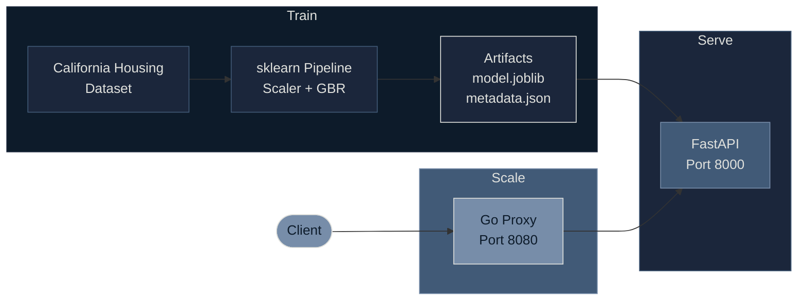

<div align="center">

# MLOps Engineering

**Production-grade ML systems built with Python and Go, deployed with containers and Kubernetes.**

[](https://python.org)
[](https://go.dev)
[](https://docker.com)
[](https://kubernetes.io)
[](LICENSE)

</div>

<br>

## The Idea

Most ML projects stop at a Jupyter notebook. This one doesn't.

This repository takes a house price prediction model from raw data all the way to a production-ready, containerized service — complete with a Go proxy for high-throughput inference, MLflow for experiment tracking, and Docker Compose for one-command deployment.

The goal is simple: **show what it actually takes to ship an ML model**, not just train one.

---

## How It All Fits Together



Three stages, each with a clear job:

- **Train** — Load data, build a pipeline, evaluate, save artifacts, log everything to MLflow.
- **Serve** — FastAPI loads the trained model and exposes prediction endpoints with Pydantic validation.
- **Scale** — A Go proxy adds connection pooling, request validation, size limits, structured logging, and metrics on top.

They run independently in development. In production, Docker Compose wires them together — the proxy waits for the model API to be healthy before accepting traffic.

---

## The Model

### What it predicts

Median house value for California census block groups, in units of **$100,000**. The data comes from the 1990 U.S. Census via scikit-learn's California Housing dataset.

### The 8 input features

| Feature | What it captures | Typical range |
|---------|-----------------|---------------|
| `MedInc` | Median income | 0.5 -- 15.0 |
| `HouseAge` | Median house age (years) | 1 -- 52 |
| `AveRooms` | Avg rooms per household | 0.9 -- 142 |
| `AveBedrms` | Avg bedrooms per household | 0.3 -- 26 |
| `Population` | Block group population | 3 -- 35,682 |
| `AveOccup` | Avg household size | 0.7 -- 1,243 |
| `Latitude` | Latitude | 32.5 -- 42.0 |
| `Longitude` | Longitude | -124.4 -- -114.3 |

### How it performs

The model is a **Gradient Boosting Regressor** (200 trees, depth 5, learning rate 0.1) wrapped in an sklearn Pipeline with StandardScaler preprocessing. Trained on 16,512 samples, evaluated on 4,128.

| | RMSE | MAE | R² |
|---|---|---|---|
| **Train** | 0.382 | 0.265 | 0.891 |
| **Test** | 0.466 | 0.311 | 0.835 |

R² of **0.835** on held-out data. The train-test gap is small — the model generalizes well without overfitting.

---

## Training Pipeline

Training is fully reproducible. A `TrainingConfig` dataclass pins every parameter — random seed, split ratio, hyperparameters, output paths. Nothing is left to chance.

The pipeline runs in three steps:

1. **Load & split** — Fetches the California Housing dataset, splits 80/20, computes per-feature statistics for downstream drift monitoring.
2. **Train & track** — Builds an sklearn Pipeline (StandardScaler → GradientBoostingRegressor), trains it, and logs everything to MLflow: parameters, metrics (RMSE, MAE, R²), and training time.
3. **Save & log** — Serializes the trained pipeline to `model.joblib`, writes full metadata (including feature stats) to `metadata.json`, and uploads both as MLflow artifacts.

Every run is an MLflow experiment. Compare runs, roll back, or promote — the artifacts are versioned and self-describing.

---

## Serving Layer

### FastAPI (Python)

The model API loads `model.joblib` and `metadata.json` at startup using FastAPI's lifespan context manager. No lazy loading, no cold starts on first request.

Four endpoints:

| Endpoint | Method | Purpose |
|----------|--------|---------|
| `/health` | GET | Liveness check — returns model load status |
| `/model/info` | GET | Model type, feature names, test metrics, sample count |
| `/predict` | POST | Single prediction — send 8 features, get a price |
| `/predict/batch` | POST | Batch prediction — send N instances, get N prices |

All inputs are validated with Pydantic. Send the wrong number of features and you get a `422` with a clear error, not a cryptic stack trace.

### Go Proxy

Python is great for ML. It's not great for handling thousands of concurrent connections. The Go proxy sits in front of FastAPI and handles the traffic-shaping concerns:

- **Validates** requests before they reach Python (JSON structure, feature count)
- **Limits** request sizes (1MB single, 10MB batch)
- **Pools** TCP connections (100 max idle, 90s timeout)
- **Logs** every request as structured JSON via `slog`
- **Tracks** metrics — total requests, errors, and average latency at `/metrics`

The proxy is a compiled binary under 15MB. It starts in milliseconds and adds single-digit millisecond overhead per request.

---

## API in Action

**Single prediction:**

```bash
curl -X POST http://localhost:8080/predict \
  -H "Content-Type: application/json" \
  -d '{"features": [8.3252, 41.0, 6.984, 1.024, 322.0, 2.556, 37.88, -122.23]}'
```

```json
{"prediction": 4.526}
```

**Batch prediction:**

```bash
curl -X POST http://localhost:8080/predict/batch \
  -H "Content-Type: application/json" \
  -d '{"instances": [
    [8.3252, 41.0, 6.984, 1.024, 322.0, 2.556, 37.88, -122.23],
    [5.6431, 52.0, 5.817, 1.073, 558.0, 2.547, 37.85, -122.25]
  ]}'
```

```json
{"predictions": [4.526, 3.585]}
```

---

## Tech Stack

| Layer | Tools |
|-------|-------|
| **ML** | scikit-learn, pandas, numpy |
| **Serving** | FastAPI, Pydantic v2, uvicorn |
| **Proxy** | Go 1.22, net/http, slog |
| **Tracking** | MLflow |
| **Containers** | Docker (multi-stage), Docker Compose |

---

## Design Decisions

**Python for ML, Go for infrastructure.** Each language does what it's best at. Python handles data, training, and model serving. Go handles request routing, validation, and connection management.

**Validation at every layer.** The Go proxy validates before forwarding. FastAPI validates again with Pydantic. Two layers mean bad input never reaches the model.

**Config as code.** Every training parameter lives in a dataclass with defaults. No magic numbers scattered across scripts. Change the config, re-train, compare in MLflow.

**Observability from day one.** Structured JSON logs, a `/metrics` endpoint, `/health` checks, and MLflow tracking. When something goes wrong in production, the data is already there.

---

## License

[MIT](LICENSE)
