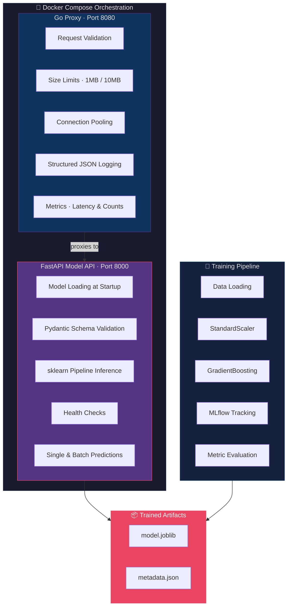
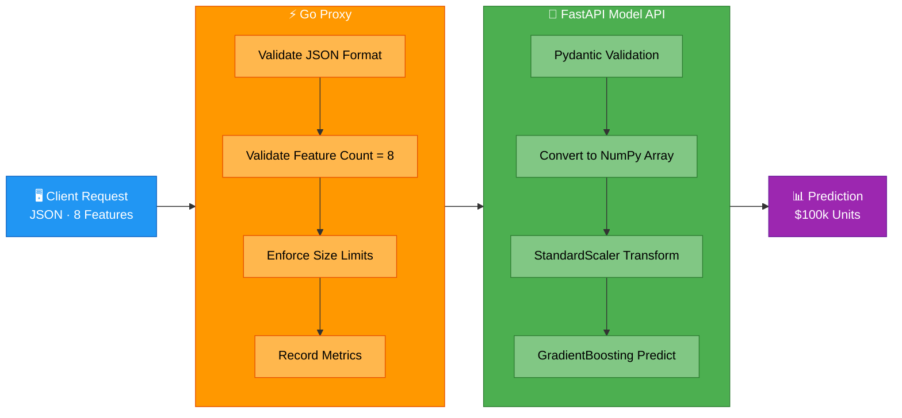

<div align="center">

# MLOps Engineering

**Production-grade ML systems built with Python and Go, deployed with containers and Kubernetes.**

[](https://python.org)
[](https://go.dev)
[](https://docker.com)
[](https://kubernetes.io)
[](LICENSE)

---

*Bridging the gap between ML notebooks and production systems — from experiment tracking to scaled deployment.*

</div>

## Table of Contents

- [Overview](#overview)
- [Architecture](#architecture)
- [House Price Prediction Service](#house-price-prediction-service)
  - [Problem Statement](#problem-statement)
  - [Dataset](#dataset)
  - [Model](#model)
  - [Training Pipeline](#training-pipeline)
  - [Model Serving (FastAPI)](#model-serving-fastapi)
  - [Go High-Throughput Proxy](#go-high-throughput-proxy)
  - [API Reference](#api-reference)
  - [Experiment Tracking (MLflow)](#experiment-tracking-mlflow)
  - [Testing](#testing)
  - [Docker Deployment](#docker-deployment)
- [Project Structure](#project-structure)
- [Quick Start](#quick-start)
- [Tech Stack](#tech-stack)
- [Design Philosophy](#design-philosophy)
- [License](#license)

---

## Overview

This repository implements end-to-end MLOps workflows as production-ready services. Each project demonstrates a different slice of the ML lifecycle:

| Area | What's Covered |
|------|---------------|
| **Model Serving** | FastAPI + Go high-throughput inference endpoints |
| **Training Pipelines** | Reproducible training with MLflow tracking, hyperparameter configuration |
| **Feature Engineering** | StandardScaler preprocessing, feature statistics tracking |
| **Monitoring & Drift** | Feature statistics collection for drift detection |
| **Infrastructure** | Dockerized services, multi-stage builds, health checks |

---

## Architecture



### Data Flow for Predictions



---

## House Price Prediction Service

### Problem Statement

Predict California house prices based on census-level features. The model predicts the **median house value** for a given block group, expressed in units of **$100,000**.

### Dataset

The service uses the **California Housing dataset** from scikit-learn, derived from the 1990 U.S. Census.

| Property | Value |
|----------|-------|
| Total Samples | 20,640 |
| Training Samples | 16,512 (80%) |
| Test Samples | 4,128 (20%) |
| Features | 8 |
| Target | Median house value ($100k) |

**Input Features:**

| Feature | Description | Mean | Range |
|---------|-------------|------|-------|
| `MedInc` | Median income in block group | 3.88 | 0.50 -- 15.00 |
| `HouseAge` | Median house age in block group | 28.61 | 1 -- 52 |
| `AveRooms` | Average number of rooms per household | 5.44 | 0.89 -- 141.91 |
| `AveBedrms` | Average number of bedrooms per household | 1.10 | 0.33 -- 25.64 |
| `Population` | Block group population | 1,426 | 3 -- 35,682 |
| `AveOccup` | Average number of household members | 3.10 | 0.69 -- 1,243 |
| `Latitude` | Block group latitude | 35.64 | 32.55 -- 41.95 |
| `Longitude` | Block group longitude | -119.58 | -124.35 -- -114.31 |

### Model

| Property | Value |
|----------|-------|
| Algorithm | Gradient Boosting Regressor |
| Preprocessing | StandardScaler |
| Framework | scikit-learn Pipeline |
| Serialization | joblib |

**Hyperparameters:**

| Parameter | Value |
|-----------|-------|
| `n_estimators` | 200 |
| `max_depth` | 5 |
| `learning_rate` | 0.1 |
| `subsample` | 0.8 |
| `min_samples_leaf` | 10 |

**Performance Metrics:**

| Metric | Train | Test |
|--------|-------|------|
| RMSE | 0.3821 | 0.4657 |
| MAE | 0.2645 | 0.3111 |
| R² | 0.8908 | 0.8345 |

The model achieves an R² of **0.8345** on the test set, explaining ~83% of variance in house prices. The small gap between train and test metrics indicates good generalization with minimal overfitting.

### Training Pipeline

The training pipeline is located in `services/house-prices/training/` and consists of three modules:

**`training/config.py`** -- Training configuration as a Python dataclass:
- Model type and hyperparameters
- Data split ratio (80/20)
- Random seed (42) for reproducibility
- Artifact output paths

**`training/data.py`** -- Data loading and feature statistics:
- Loads California Housing dataset from scikit-learn
- Splits into train/test sets
- Computes per-feature statistics (mean, std, min, max, median) for drift monitoring

**`training/train.py`** -- Main training orchestration:
1. Creates artifacts directory
2. Loads and splits the dataset
3. Builds an sklearn Pipeline (StandardScaler + GradientBoostingRegressor)
4. Trains the model with MLflow experiment tracking
5. Evaluates on train and test sets (RMSE, MAE, R²)
6. Saves `model.joblib` and `metadata.json` to `artifacts/`
7. Logs all parameters, metrics, and artifacts to MLflow

```bash
# Run training
cd services/house-prices
python -m training.train
```

### Model Serving (FastAPI)

The serving layer is in `services/house-prices/serving/` and provides a REST API for inference.

**`serving/schemas.py`** -- Pydantic models for type-safe request/response validation:
- `PredictionRequest`: Single prediction (list of 8 floats)
- `BatchPredictionRequest`: Multiple predictions
- `PredictionResponse` / `BatchPredictionResponse`: Results in $100k units
- `HealthResponse`: Service health status
- `ModelInfoResponse`: Model metadata and metrics

**`serving/app.py`** -- FastAPI application:
- Loads the trained model and metadata at startup via a lifespan context manager
- Validates input dimensions (exactly 8 features required)
- Converts inputs to numpy arrays for inference
- Returns predictions with appropriate error codes

```bash
# Start the API server
cd services/house-prices
uvicorn serving.app:app --host 0.0.0.0 --port 8000
```

### Go High-Throughput Proxy

Located in `services/house-prices/serving/go/`, this Go proxy sits in front of the Python API for production deployments.

**Features:**
- **Request validation** -- Validates JSON structure and feature count before forwarding
- **Size limits** -- 1MB for single predictions, 10MB for batch
- **Connection pooling** -- Reuses TCP connections (100 max idle, 90s timeout)
- **Structured logging** -- JSON-formatted logs via `slog`
- **Metrics endpoint** -- Exposes total requests, errors, and average latency at `/metrics`

```bash
# Build and run the Go proxy
cd services/house-prices/serving/go
go build -o proxy .
./proxy -port 8080 -backend http://localhost:8000
```

### API Reference

All endpoints are available through both the FastAPI server (port 8000) and Go proxy (port 8080).

#### `GET /health`

Health check endpoint.

**Response:**
```json
{
  "status": "healthy",
  "model_loaded": true
}
```

#### `GET /model/info`

Returns model metadata, feature names, and test metrics.

**Response:**
```json
{
  "model_type": "gradient_boosting",
  "feature_names": ["MedInc", "HouseAge", "AveRooms", "AveBedrms", "Population", "AveOccup", "Latitude", "Longitude"],
  "test_metrics": {"rmse": 0.4657, "mae": 0.3111, "r2": 0.8345},
  "train_samples": 16512
}
```

#### `POST /predict`

Single prediction endpoint.

**Request:**
```json
{
  "features": [8.3252, 41.0, 6.984, 1.024, 322.0, 2.556, 37.88, -122.23]
}
```

**Response:**
```json
{
  "prediction": 4.526
}
```

**Errors:**
- `422`: Wrong number of features (expected 8)

#### `POST /predict/batch`

Batch prediction endpoint.

**Request:**
```json
{
  "instances": [
    [8.3252, 41.0, 6.984, 1.024, 322.0, 2.556, 37.88, -122.23],
    [5.6431, 52.0, 5.817, 1.073, 558.0, 2.547, 37.85, -122.25]
  ]
}
```

**Response:**
```json
{
  "predictions": [4.526, 3.585]
}
```

#### `GET /metrics` (Go proxy only)

Exposes proxy-level metrics.

**Response:**
```json
{
  "total_requests": 1500,
  "total_errors": 3,
  "avg_latency_ms": 12.5
}
```

### Experiment Tracking (MLflow)

Training runs are tracked with MLflow under the experiment name `house-prices`.

**What gets logged:**

| Category | Items |
|----------|-------|
| Parameters | model_type, n_estimators, max_depth, learning_rate, subsample, min_samples_leaf |
| Metrics | train_time_seconds, train_rmse, train_mae, train_r2, test_rmse, test_mae, test_r2 |
| Artifacts | model.joblib, metadata.json |

```bash
# Launch MLflow UI to view experiments
mlflow ui
# Navigate to http://localhost:5000
```

### Testing

Tests are in `services/house-prices/tests/` with 12 total tests covering training and serving.

**Training Tests** (`test_training.py`):
- `test_load_dataset` -- Verifies dataset shape, feature count (8), and train/test split
- `test_feature_stats` -- Validates feature statistics computation
- `test_build_pipeline` -- Confirms pipeline structure (scaler + model)
- `test_evaluate` -- Tests metric computation (RMSE, MAE, R² > 0.5)
- `test_train_e2e` -- End-to-end training with temp directory and reduced params

**Serving Tests** (`test_serving.py`):
- `test_health` -- Health endpoint returns 200 with model_loaded=true
- `test_model_info` -- Model info returns correct type and 8 features
- `test_predict` -- Single prediction returns positive float
- `test_predict_wrong_feature_count` -- Wrong feature count returns 422
- `test_predict_batch` -- Batch prediction returns correct number of results

```bash
# Run all tests with coverage
make test

# Run tests directly
cd services/house-prices
pytest tests/ -v --tb=short
```

### Docker Deployment

The service ships with two Dockerfiles and a docker-compose configuration.

**`Dockerfile`** (Python/FastAPI) -- Multi-stage build:
1. Base image: `python:3.11-slim`
2. Installs dependencies
3. Trains the model at build time
4. Serves via uvicorn on port 8000

**`Dockerfile.go`** (Go Proxy) -- Multi-stage build:
1. Build stage: `golang:1.22-alpine`
2. Compiles the proxy binary
3. Runtime stage: `alpine:3.19` (minimal image)
4. Runs on port 8080

**`docker-compose.yml`** orchestrates both services:

```bash
# Build and start all services
cd services/house-prices
docker compose up --build

# Or use Makefile from project root
make docker-build
make docker-up

# Stop services
make docker-down
```

| Service | Port | Description |
|---------|------|-------------|
| `model-api` | 8000 | FastAPI model server with health checks |
| `go-proxy` | 8080 | Go proxy (waits for model-api to be healthy) |

---

## Project Structure

```
mlops-engineering/
├── services/
│   └── house-prices/              # House price prediction service
│       ├── training/
│       │   ├── config.py           # TrainingConfig dataclass
│       │   ├── data.py             # Dataset loading & feature stats
│       │   └── train.py            # Training orchestration + MLflow
│       ├── serving/
│       │   ├── app.py              # FastAPI application
│       │   ├── schemas.py          # Pydantic request/response models
│       │   └── go/
│       │       ├── main.go         # Go high-throughput proxy
│       │       └── go.mod          # Go module definition
│       ├── artifacts/
│       │   ├── model.joblib        # Trained sklearn pipeline
│       │   └── metadata.json       # Model metadata & metrics
│       ├── tests/
│       │   ├── test_training.py    # Training pipeline tests
│       │   └── test_serving.py     # API serving tests
│       ├── Dockerfile              # Python/FastAPI container
│       ├── Dockerfile.go           # Go proxy container
│       ├── docker-compose.yml      # Multi-service orchestration
│       └── requirements.txt        # Service-specific dependencies
├── pipelines/                      # ML pipeline definitions
│   ├── training/
│   ├── serving/
│   └── monitoring/
├── configs/                        # Configuration files
├── deployments/
│   ├── docker/                     # Docker deployment configs
│   └── k8s/                        # Kubernetes manifests
├── cmd/                            # Go application entrypoints
├── internal/                       # Go internal packages
├── pkg/                            # Go public packages
├── scripts/                        # Utility scripts
├── tests/                          # Root-level tests
├── docs/                           # Documentation
├── Makefile                        # Build automation
├── requirements.txt                # Root Python dependencies
└── README.md
```

---

## Quick Start

### Prerequisites

- Python 3.11+
- Go 1.22+ (for the proxy)
- Docker & Docker Compose (for containerized deployment)

### Local Development

```bash
# 1. Clone the repository
git clone <repo-url>
cd mlops-engineering

# 2. Install dependencies
make install

# 3. Train the model
cd services/house-prices
python -m training.train

# 4. Start the API server
uvicorn serving.app:app --host 0.0.0.0 --port 8000

# 5. Test a prediction
curl -X POST http://localhost:8000/predict \
  -H "Content-Type: application/json" \
  -d '{"features": [8.3252, 41.0, 6.984, 1.024, 322.0, 2.556, 37.88, -122.23]}'
```

### Docker Deployment

```bash
# Build and run everything
cd services/house-prices
docker compose up --build

# Test via Go proxy
curl http://localhost:8080/health
curl http://localhost:8080/metrics
curl -X POST http://localhost:8080/predict \
  -H "Content-Type: application/json" \
  -d '{"features": [8.3252, 41.0, 6.984, 1.024, 322.0, 2.556, 37.88, -122.23]}'
```

### Run Tests

```bash
# Python tests with coverage
make test

# Go tests
make test-go

# Lint
make lint
```

---

## Tech Stack

<table>
<tr><td><b>ML & Serving</b></td><td>scikit-learn, FastAPI, MLflow, joblib</td></tr>
<tr><td><b>Infrastructure</b></td><td>Go, Docker, Docker Compose</td></tr>
<tr><td><b>Observability</b></td><td>Structured JSON logging (slog), custom metrics endpoint</td></tr>
<tr><td><b>Validation</b></td><td>Pydantic v2, Go request validation</td></tr>
<tr><td><b>Testing</b></td><td>pytest, pytest-cov, httpx (TestClient)</td></tr>
<tr><td><b>CI/CD</b></td><td>Makefile-driven builds</td></tr>
</table>

---

## Design Philosophy

> **Python for ML logic. Go for infrastructure. Containers for everything.**

- **Reproducibility** -- Pinned random seeds, config-as-code, MLflow experiment tracking
- **Separation of concerns** -- Training, serving, and proxy are independent modules
- **Defense in depth** -- Input validation at both Go proxy and FastAPI layers
- **Observability first** -- Structured logging, metrics, and health checks built in from day one
- **Production-ready** -- Docker multi-stage builds, connection pooling, request size limits

---

## License

[MIT](LICENSE)
